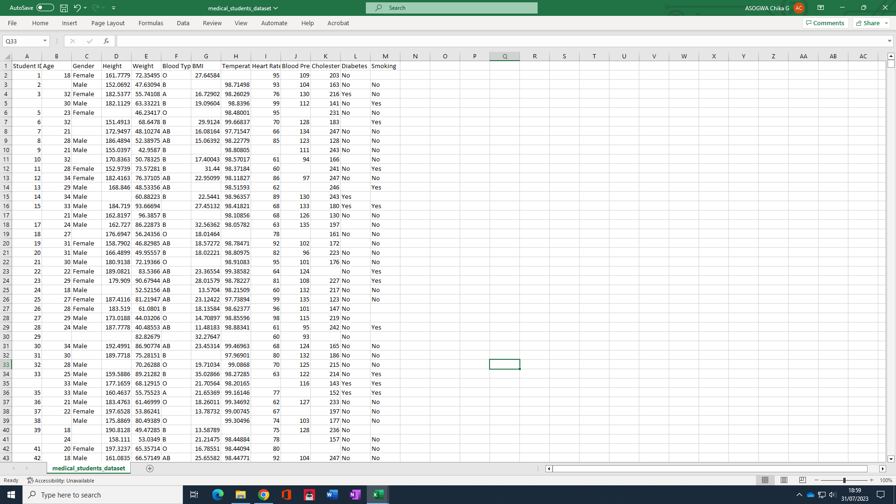
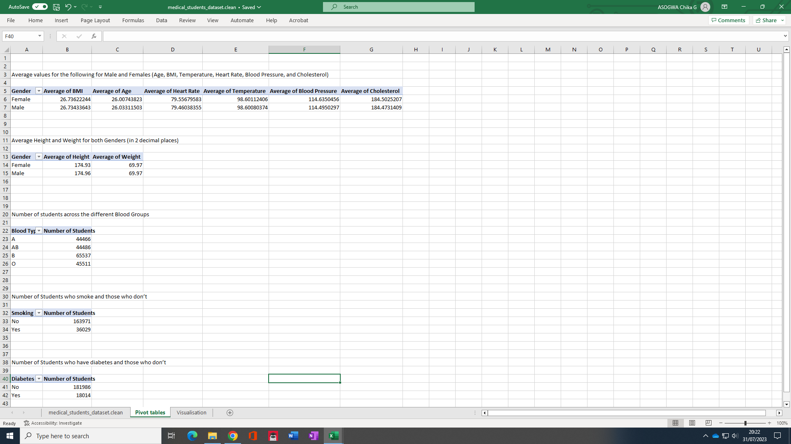

# Medical-Students-Data-Analysis

# Introduction
This task focus on the insightful analysis of the Medical Students Data, focusing on key parameters and statistics to better understand the health profile of medical students at Chika's University.

# Activity
Using the provided data, we are required to create Pivot Tables displaying the average values for various health metrics, as well as other relevant statistics, categorized by gender and medical conditions. Below are the necessary tasks we required to perform for this project:

1. Average Values for Male and Female Students:
   - Age: The average age for male and female students was calculated separately.
   - BMI (Body Mass Index): Average BMI for male and female students.
   - Temperature: Average body temperature for male and female students.
   - Heart Rate: Average heart rate for male and female students.
   - Blood Pressure: Average blood pressure for male and female students.
   - Cholesterol: Average cholesterol level for male and female students.

2. Average Height and Weight for both Genders:
   - Average Height: The average height of male and female students (rounded to two decimal places).
   - Average Weight: The average weight of male and female students (rounded to two decimal places).

3. Number of Students across Different Blood Groups:
   - The distribution of students across various blood groups is presented, providing an overview of the blood group distribution within the cohort.

4. Number of Students Who Smoke and Those Who Don't:
   - The count of students who smoke and those who don't, allowing us to understand the prevalence of smoking habits among the students.

5. Number of Students Who Have Diabetes and Those Who Don't:
   - The count of students with diabetes and those without, enabling us to assess the incidence of diabetes in the student population.

# Skill Demonstrated
1. Data Cleaning
2. Data Manipulation
3. Pivot tables

# Raw Data
The Medical Student Dataset, comprises 13 essential columns and an impressive 200,000 records. The dataset encompasses crucial parameters, providing invaluable insights into the health profile of our medical student population.

The dataset includes the following columns:

1. Student ID: A unique identifier for each medical student in the dataset.
2. Age: The age of each student at the time of data collection.
3. Height: The height of each student, providing anthropometric information.
4. Weight: The weight of each student, essential for assessing body mass characteristics.
5. Body Temperature: The recorded body temperature of each student, helping gauge health status.
6. Diabetes: A binary attribute indicating whether a student has diabetes (Yes) or not (No).
7. Cholesterol: Cholesterol levels of each student, a key indicator of cardiovascular health.
8. Blood Type: The blood type of each student A, B, AB, O, aiding in blood group distribution analysis.
9. Blood Pressure: The recorded blood pressure values for each student, essential for cardiovascular assessment.
10. Gender: The gender classification of each student as male or female.
11. BMI (Body Mass Index): Calculated BMI values for each student, a measure of body composition.
12. Smoking: A binary attribute indicating whether a student smokes (Yes) or not (No).
    

# Data Cleaning
To clean the dataset, I first conducted a thorough assessment of missing values in each column. It was observed that approximately 20,000 records were missing in each column, accounting for about 10% of the data, which is below the acceptable threshold of 40%. Hence, I opted to use the imputation method for data cleaning.

As the dataset consists of both numerical and categorical data, they required distinct imputation approaches. For the numerical columns, which include age, height, weight, temperature, heart rate, blood pressure, and cholesterol, I decided to impute the missing values with the average value of each respective column. By doing so, we ensure minimal disruption to the overall statistical distribution.

However, for the BMI column, we employed a slightly different approach. To obtain the missing values, we performed data manipulation using the height and weight columns. As BMI is calculated using the formula BMI = kg/m^2, we first converted the height column from centimeters to meters. Subsequently, we applied the mathematical calculation as follows: BMI = weight / (Height(M) * Height(M)). This enabled us to derive accurate BMI values for the affected records.

Moving on to the categorical columns, such as gender, diabetes, blood type, and smoking, we utilized the Mode imputation technique. The Mode refers to the value that appears most frequently in each column. To determine the Mode, we obtained the unique values in each categorical column and used the =COUNTIF() function with a value in the column as a criteria. This process ensured that we assigned the most common value to the missing records, thereby preserving the integrity of the categorical distribution.

# Data Manipulation
- To compute the Average Values for Male and Female Students' Age, BMI, Temperature, Heart Rate, Blood Pressure, and Cholesterol, we employed a Pivot table as follows:

1. First, we created a Pivot table because our objective was to find the average for each category based on gender. To achieve this, we added the "Gender" column to the row field of the pivot table.

2. Next, we included the columns "Age," "BMI," "Temperature," "Heart Rate," "Blood Pressure," and "Cholesterol" to the value field of the pivot table. This allowed the pivot table to automatically compute the total for each of these columns based on gender.

3. To calculate the average values instead of the sum for each variable in the values field, we proceeded as follows:
   a. Click on each variable (Age, BMI, Temperature, Heart Rate, Blood Pressure, and Cholesterol) in the values field of the pivot table.
   b. Click on "Value Field Settings" for each variable.
   c. In the Value Field Settings dialog box, select "Average" instead of "Sum" as the summary function.
4. Moreover, we wanted to focus solely on the average values for each gender in the "Age," "BMI," "Temperature," "Heart Rate," "Blood Pressure," and "Cholesterol" columns. To achieve this, we removed the grand total from the pivot table by right-clicking on the Pivot table, placing the cursor on Grand Total, and selecting "Remove Grand Total."

- To compute the Average Height and Weight for both Genders (rounded to two decimal places), we effectively utilized a Pivot table following these steps:

1. We initiated the process by creating a Pivot table to attain the desired objective of finding the average for each category based on gender. In doing so, we added the "Gender" column to the row field of the pivot table.

2. Subsequently, we included the "Height" and "Weight" columns in the value field of the pivot table. By doing this, the pivot table automatically computed the total for each of these columns based on gender.

3. To ensure the calculation of average values rather than sums for each variable in the values field, we followed these steps:
   a. Clicked on each variable (Height and Weight) in the values field of the pivot table.
   b. Clicked on "Value Field Settings" for each variable.
   c. In the Value Field Settings dialog box, we selected "Average" instead of "Sum" as the summary function.

4. Additionally, we removed the grand total from the pivot table to focus solely on the average values for each gender in the "Height" and "Weight" columns. To do this, we right-clicked on the Pivot table, placed the cursor on Grand Total, and selected "Remove Grand Total."

5. Finally, to ensure the average values were displayed with two decimal places, we applied proper number formatting:
   a. Right-clicked on the Pivot table.
   b. Selected "Number Formatting."
   c. Set the decimal places to 2 in the Number Formatting dialog box.
   
- To compute the distribution of students across various blood groups, we employed a Pivot table using the following steps:

1. We initiated the process by creating a Pivot table with the objective of finding the number of students in each blood group. To achieve this, we placed the "Blood Group" column into the row field, which created a record for each unique blood group in the column.

2. Next, we placed the "Blood Group" column in the value field of the pivot table to compute the total number of students in each blood group.

3. Additionally, we removed the grand total from the pivot table to focus solely on the total values for each blood group (A, B, AB, O). To do this, we right-clicked on the Pivot table, placed the cursor on Grand Total, and selected "Remove Grand Total."

- To count the number of students who smoke and those who don't, we utilized a Pivot table following these steps:

1. We started by creating a Pivot table with the objective of determining the count of students based on their smoking status. To achieve this, we placed the "Smoking" column into the row field, which created separate records for "Yes" (students who smoke) and "No" (students who don't smoke).

2. Next, we added the "Smoking" column to the value field of the pivot table to compute the total number of students in each category (smokers and non-smokers).

3. Additionally, to focus solely on the total counts for "Yes" (smokers) and "No" (non-smokers), we removed the grand total from the pivot table. To do this, we right-clicked on the Pivot table, placed the cursor on Grand Total, and selected "Remove Grand Total."

- To count the number of students who have diabetes and those who don't, we utilized a Pivot table following these steps:

1. We began by creating a Pivot table with the objective of determining the count of students based on their diabetes status. To achieve this, we placed the "Diabetes" column into the row field, which created separate records for "Yes" (students who have diabetes) and "No" (students who don't have diabetes).

2. Next, we added the "Diabetes" column to the value field of the pivot table to compute the total number of students in each category (diabetes and non-diabetes).

3. Additionally, to focus solely on the total counts for "Yes" (students with diabetes) and "No" (students without diabetes), we removed the grand total from the pivot table. To do this, we right-clicked on the Pivot table, placed the cursor on Grand Total, and selected "Remove Grand Total."

# Visualisation
1. Our visualization demonstrates that, on average, females exhibit higher BMI, heart rate, blood pressure, cholesterol, and temperature in comparison to males.

To create this visualization, we utilized the "Insert" feature in Excel and selected the column chart as our preferred visualization type. The data source for this visualization was derived from "PivotTable1." After setting up the chart, we carefully formatted it by removing the vertical axes, legend, and gridlines, as well as hiding any unnecessary buttons for a cleaner display.

To highlight the categories with the highest and smallest averages, we employed color-coding. The highest average was emphasized using a green color, while the smallest average was distinguished with a red color.

3. 
# Conclusion
